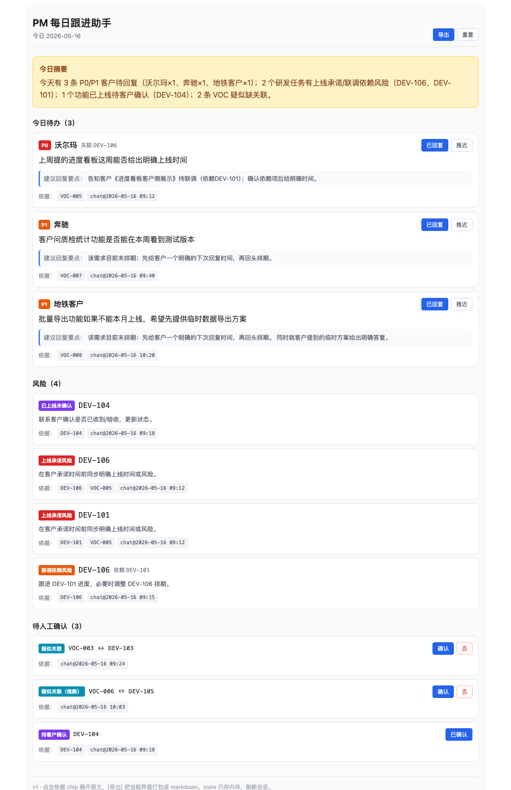

# ai-pm-poc

**PM 每日跟进助手 PoC** —— 把 VOC / 研发任务 / 群聊三类数据合在一起，自动生成今日待回复、风险、待人工确认的清单，每条结论带依据，PM 在界面上确认/勾选，导出 markdown 同步给同事。

v1：纯规则、本地 mock 数据、无 LLM、无后端、无数据库。详细规格见 [SPEC.md](./SPEC.md)。



## 快速开始

```bash
npm install
npm run dev      # http://localhost:5173
```

其他常用命令：

```bash
npm run verify   # 跑 SPEC §8 全部 7 条验收（12/12 通过）
npm run build    # 生产构建
```

## 三分钟演示脚本

打开 http://localhost:5173，依次操作：

1. **看摘要**：顶部黄色块一句话告诉你今天 N 条待回复、M 个风险、K 个待确认。
2. **看待办**：3 张卡片（沃尔玛 P0 / 奔驰 P1 / 地铁 P1），每张带建议回复要点 + 依据 chip。
3. **看风险**：4 条，覆盖三种类型 —— 已上线未确认 (DEV-104)、上线承诺 (DEV-101 / DEV-106)、联调依赖 (DEV-106)。
4. **看待人工确认**：3 条，2 条疑似关联（VOC-003↔DEV-103、VOC-006↔DEV-105 推断）+ 1 条待客户确认 (DEV-104)。
5. **点 `VOC-005` 依据 chip** → 展开沃尔玛 VOC 原文；再点 `chat@2026-05-16 09:12` → 切到群聊原文。
6. **点 "VOC-003 ↔ DEV-103" 旁的 [确认]** → 该项消失，摘要数字 −1。
7. **点 DEV-104 的 [已确认]** → 同时从 "已上线未确认" 风险和 "待客户确认" 里消失。
8. **点沃尔玛待办的 [已回复]** → 待办少一条。
9. **点 header 的 [导出]** → 弹出 markdown 预览，[复制] / [下载 .md]。
10. **点 [重置]** → 恢复到初始状态，可以重新跑一遍。

每条结论后面的灰色小 chip（`VOC-005`、`chat@2026-05-16 09:12` 等）就是依据，点开就是原文。

## 设计要点

- **System 提名，PM 拍板**：规则只判断能确定的事（VOC 待回复 + P0/P1、DEV 备注含"待客户确认"、群聊关键词命中）；任何错了代价高的（VOC↔DEV 关联、客户是否真的确认了上线）都进 "待人工确认" 等 PM 勾。
- **每条结论必带依据**：UI 上是 chip，markdown 导出里是 `` ` ``包起来的 id。导出后到群里发，组里人能反查到原始 VOC 行 / DEV 行 / 群聊原句。
- **HITL 闭环**：人工确认后 state 改变，整张页面（待办 / 风险 / 摘要）当场 recompute，不用刷新。
- **可演进**：parseChat 是纯规则版，签名是 `(chat, voc, dev) → 信号`。v2 换成 LLM 调用，上层 todos/risks/pending 不用改。

## 项目结构

```
ai-pm-poc/
├── SPEC.md               # 规格文档
├── README.md
├── verify.js             # SPEC §8 验收脚本
├── docs/screenshot.png
└── src/
    ├── App.jsx           # useReducer 管 state + 渲染四块 + 导出弹窗
    ├── main.jsx
    ├── state.js          # initialState / TODAY / reducer
    ├── compose.js        # compute() —— UI 和 verify.js 共用
    ├── data/             # mock VOC / DEV / 群聊
    │   ├── voc.js
    │   ├── dev.js
    │   └── chat.js
    ├── rules/            # 纯规则函数
    │   ├── parseChat.js
    │   ├── enrich.js
    │   ├── todos.js
    │   ├── risks.js
    │   ├── pending.js
    │   └── summary.js
    ├── lib/
    │   ├── evidence.js   # resolveEvidence(id) / evidenceText(id)
    │   └── exportMd.js
    └── components/
        ├── Summary.jsx
        ├── Todos.jsx
        ├── Risks.jsx
        ├── Pending.jsx
        ├── EvidenceTag.jsx
        └── ExportModal.jsx
```

## 验收映射（SPEC §8）

| # | 验收 | 在哪验证 |
|---|---|---|
| 1 | 待办含 VOC-005 / VOC-007 / VOC-008 | `verify.js` §8.1 + UI 第 2 步 |
| 2 | 风险含 DEV-104 / DEV-101 / DEV-106 | `verify.js` §8.2 + UI 第 3 步 |
| 3 | 待确认含 VOC-003↔DEV-103 + VOC-006↔DEV-105 | `verify.js` §8.3 + UI 第 4 步 |
| 4 | 所有依据可 resolve | `verify.js` §8.4 + UI 第 5 步 |
| 5 | 确认关联后该项消失 | `verify.js` §8.5 + UI 第 6 步 |
| 6 | 客户确认 DEV-104 后该项消失 | `verify.js` §8.6 + UI 第 7 步 |
| 7 | 导出 markdown 内容和界面一致 | UI 第 9 步 |

## Status

- [x] SPEC v1
- [x] mock 数据 + 规则层 + verify.js（PR #12）
- [x] 四块 UI 渲染（PR #13）
- [x] EvidenceTag 点击展开 + 人工确认按钮（PR #14）
- [x] 导出 markdown + README（本 PR）

v1 完成。v2 候选方向见 SPEC §10。
